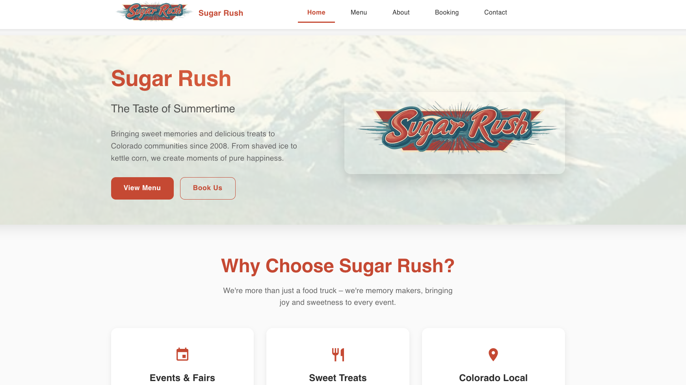

# Sugar Rush Frontend



[sugar-rush-colorado.com](https://www.sugar-rush-colorado.com)

This is the frontend website for Sugar Rush Ltd, built with React, TypeScript, and Vite.

## Prerequisites

- Node.js (version 18 or higher)
- npm

## Installation

```bash
npm install
npm run dev
```

The application will run on `http://localhost:3000`

## Environment Variables

Copy `env.example` to `.env` and fill in your values:

```bash
cp env.example .env
```

Required environment variables:

- `VITE_EMAILJS_SERVICE_ID` - Your EmailJS service ID
- `VITE_EMAILJS_BOOKING_TEMPLATE_ID` - Template ID for booking emails
- `VITE_EMAILJS_CONTACT_TEMPLATE_ID` - Template ID for contact emails
- `VITE_EMAILJS_PUBLIC_KEY` - Your EmailJS public key

Get these values from [EmailJS](https://emailjs.com/) dashboard.

## Building for Production

```bash
npm run build
npm run preview
```

## Development Commands

- `npm run dev` - Start development server with hot reload
- `npm run build` - Build for production
- `npm run preview` - Preview production build locally
- `npm run lint` - Run ESLint

## Deployment

### Netlify

This project is configured for Netlify deployment. The `netlify.toml` file handles:

- Build settings
- SPA routing redirects
- Environment variable requirements
- Static file caching

In your Netlify dashboard:

1. Set the build command to `npm run build`
2. Set the publish directory to `dist`
3. Add your environment variables in Site Settings > Environment Variables

## Menu PDF Setup

To display your actual menu, place your menu PDF file in the `public` folder with the exact filename:

```
public/sugar-rush-menu.pdf
```

## Public Files

- `sugar-rush-menu.pdf` - Your actual menu PDF (replace this)
- `placeholder.png` - Logo/brand image
- `southern-colorado-mountain.jpg` - Background image for homepage

